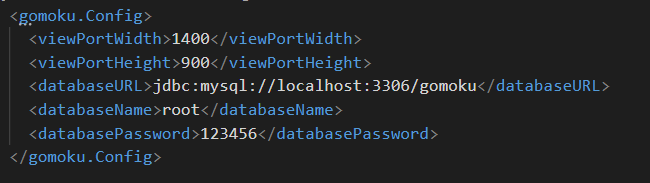
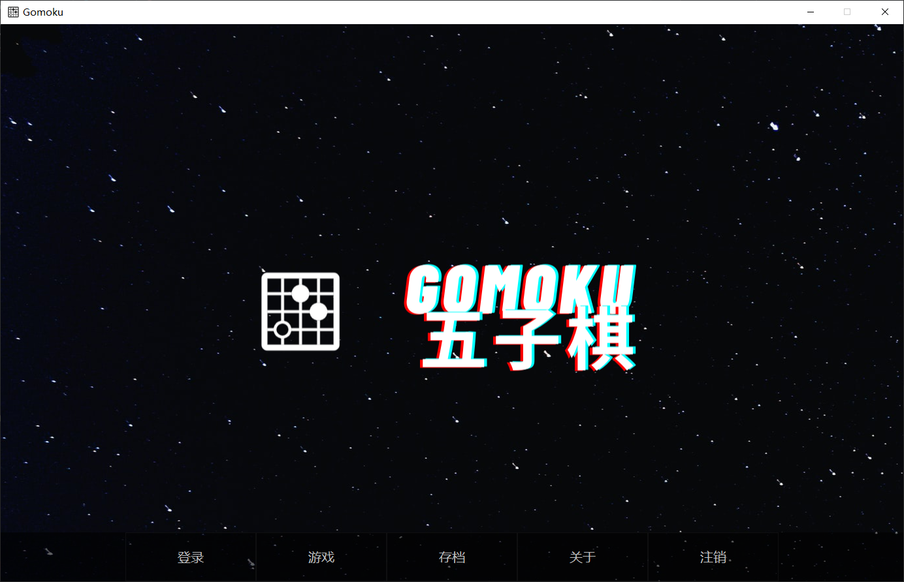
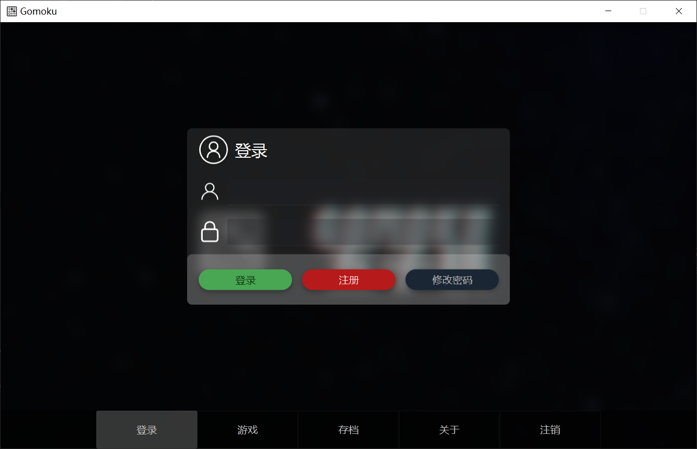
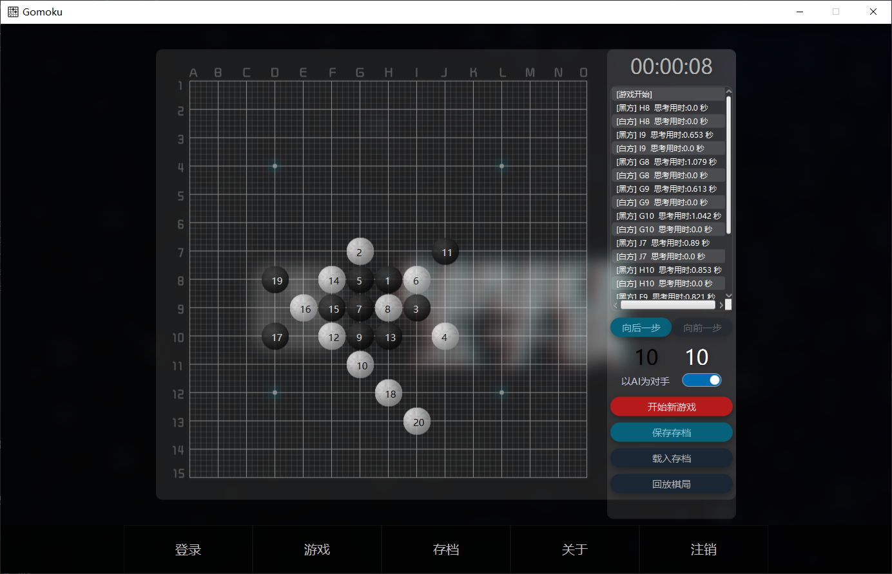
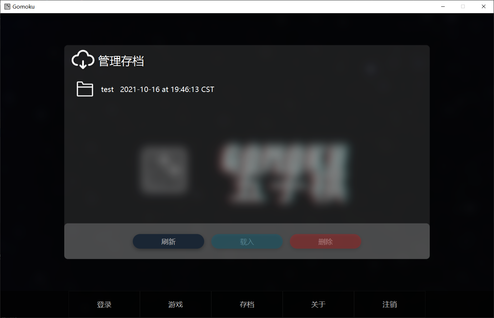

# Gomoku
**本项目是基于JavaFX和MySQL制作的五子棋游戏**

## 开发工具
* JDK1.8
* maven

## 参考开源项目
* [iGobang](https://github.com/jarryruan/iGoBang)
* [AiringGo](https://github.com/airingursb/AiringGo)

## 配置文件

根据xml的标签修改对应属性重启游戏即可应用

## 运行示例

----

---

---
